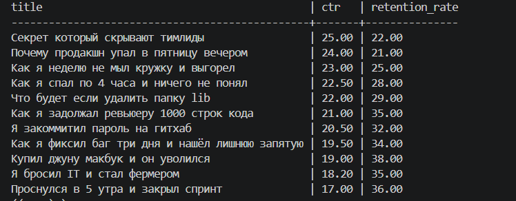

# CLI Video Report

Тестовое задание: CLI-приложение, которое читает один или несколько CSV-файлов со статистикой YouTube-видео и строит отчёт по кликбейту.

## Возможности

- Читает несколько CSV-файлов с помощью стандартного модуля `csv`
- Объединяет видео в одну коллекцию
- Находит видео с признаками кликбейта по условиям:
  - `ctr > 15`
  - `retention_rate < 40`
- Сортирует результат по `ctr` по убыванию
- Выводит отчёт в виде таблицы в консоль
- Использует расширяемую архитектуру отчётов
- Содержит тесты на `pytest`

## Структура проекта

```text
cli_video/
├── main.py
├── models/
├── reports/
├── services/
└── tests/
```

## Ожидаемый формат CSV

```csv
title,ctr,retention_rate
Video 1,16.8,35.2
Video 2,9.4,51.0
```

## Запуск

```bash
python main.py --files stats1.csv stats2.csv --report clickbait
```

## Пример вывода

```text
title   | ctr   | retention_rate
--------+-------+---------------
Video B | 22.00 | 25.00
Video A | 17.50 | 35.00
```

## Установка зависимостей для тестов

```bash
pip install -r requirements.txt
```

## Запуск тестов

```bash
pytest
```

## Как добавить новый отчёт

1. Создайте новый класс в каталоге `reports/`, наследующийся от `BaseReport`.
2. Реализуйте метод `generate(self, videos)`.
3. Зарегистрируйте класс в `reports/__init__.py`.
